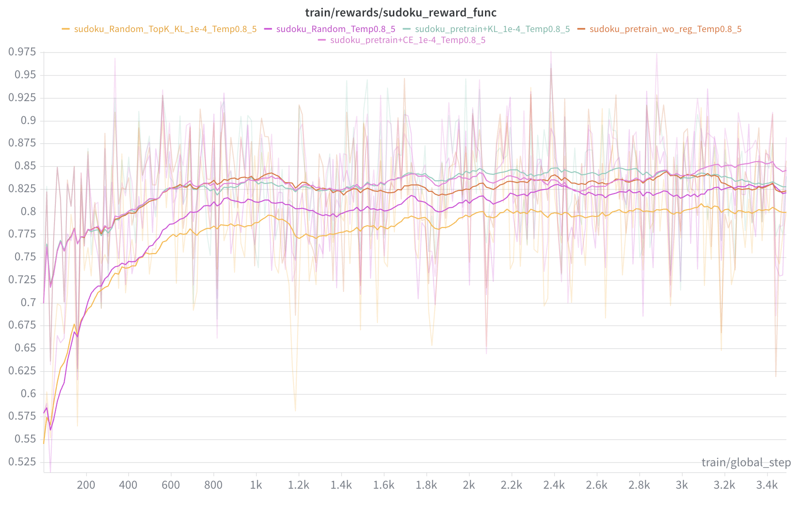
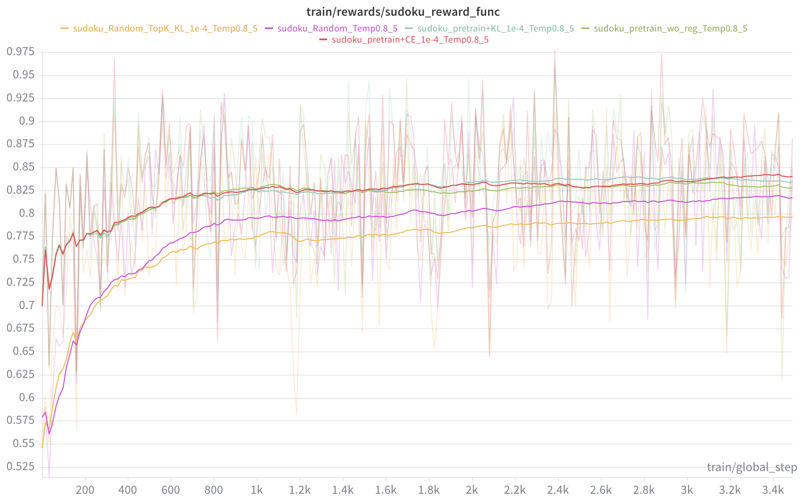
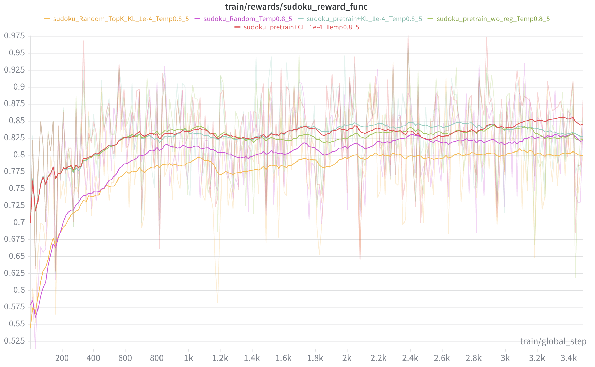

# Improving Discrete Diffusion Unmasking Policies Beyond Explicit Reference Policies
>This repository contains the official implementation for the paper [Improving Discrete Diffusion Unmasking Policies Beyond Explicit Reference Policies](https://arxiv.org/abs/2510.05725) <br> by [Chunsan Hong](https://sites.google.com/view/chunsanhong), Seonho An, Min-Soo Kim, Jong Chul Ye.

## Note
**For those interested in learned ordering for masked diffusion models**:
In my next work, unlike this research where I post-train an unmasking order on a pre-trained masked diffusion model, I propose a method to jointly train the masked diffusion model and the unmasking order from scratch. For details, please refer to the following paper:

[Unifying Masked Diffusion Models with Various Generation Orders and Beyond](https://arxiv.org/abs/2602.02112)

## Prerequisites

To run the experiments, set up the environment using the following command:

```bash
pip install -r requirements.txt
```

### Pretrained Model and Randomly Initialized Model Downloads

Softmax realization and max-confidence realization require pretrained unmasking position selection models. Furthermore, to improve reproducibility and enable efficient analysis, we saved a randomly initialized model and used it throughout all experiments. For both model weights, download from this google cloud:

https://drive.google.com/drive/folders/1DDpZ0YyY0f_Kj24t769yuVD39sFZZptW?usp=sharing

## Training

Run the following command:
```bash
cd slurm_scripts
sbatch sudoku.slurm
```
with modifying W&B configurations and model directory ("PRETRAIN_MODEL_PATH=...", "RANDOM_MODEL_PATH=...") to yours.
We trained the model 5 times and confirmed that it consistently reproduce the experimental results of Figure 3. Since the reward plot is quite messy, visualize it through a time-weighted EMA or an EMA plot in W&B.

For example,
<!--  -->
<table>
  <tr>
    <td align="center">
      
      <br />
      <sub><b>EMA reward plot</b></sub>
    </td>
    <td align="center">
      
      <br />
      <sub><b>Time-weighted EMA reward plot</b></sub>
    </td>
  </tr>
</table>

In slurm script configurations, note that (pretrain+CE)/(pretrain+KL)/(Random+TopK+KL) refer to max-confidence/softmax-confidence/Top-K confidence realization respectively. Additionally, (pretrain w/o reg)/(random w/o reg) are for ablation.

## Evaluation
For evaluation of max-confidence realization of UPO, run the following command to save results for SUDOKU test set:
```bash
cd eval
sbatch run_eval_sudoku_UPO.slurm
```
with modifying "EXTRA_PATH=.." to your model path.
For evaluation of heuristic max-confidence, run the following command to save results for SUDOKU test set:
```bash
cd eval
sbatch run_eval_sudoku_maxConf.slurm
```
Or you can modify --remasking configuration as margin, entropy, extra_bim (Top-K realization), or else.

For evaluation, run the following command:
```bash
python merge_results.py --result_path <your_result_dir>
```

**DO NOT** change the batch size (default=1), since we observed a performance drop when changing the batch size. When we conducted this research, existing discrete diffusion GRPO-style papers did not consider adding leading padding during training. As a result, if you change the batch size to a value other than 1 during evaluation, we found that the leading padding can negatively affect performance and lead to a performance drop.

## TODO
We currently release SUDOKU training code with softmax/max-confidence/Top-K realization for UPO. The pre-training code for the unmasking policy selection module and training code for other benchmarks will be released later. If you want to implement further yourself, please note that we simply performed supervised training with cross-entropy loss for pre-training, with dataset constructed by training data of SUDOKU dataset & LLaDA generations. Refer to https://github.com/kulinshah98/llm-reasoning-logic-puzzles for Zebra dataset, and https://github.com/dllm-reasoning/d1 & https://github.com/maple-research-lab/LLaDOU for other benchmarks & reward function implementations.

## Acknowledgements
- [d1: Scaling Reasoning in Diffusion Large Language Models via Reinforcement Learning](https://github.com/dllm-reasoning/d1): Helped us to create GRPO-style training & evaluation codes.

## Citation

If you wish to cite this work, please use the following BibTeX entry:

```bibtex
@inproceedings{
hong2026improving,
      title={Improving Discrete Diffusion Unmasking Policies Beyond Explicit Reference Policies},
      author={Chunsan Hong and Seonho An and Min-Soo Kim and Jong Chul Ye},
      booktitle={The Fourteenth International Conference on Learning Representations},
      year={2026},
      url={https://openreview.net/forum?id=on6cb46OhD}
}
```